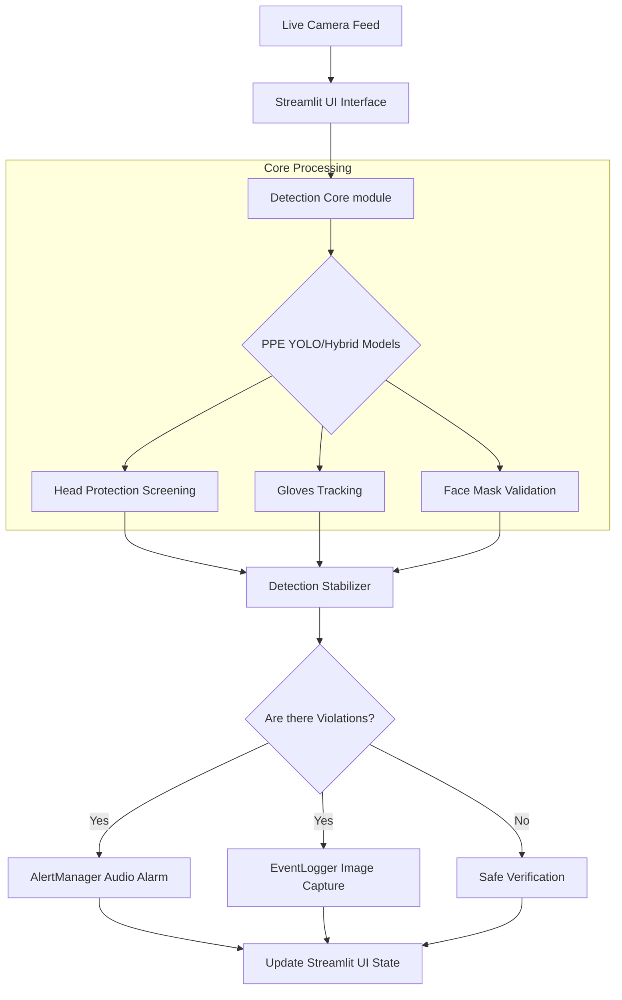

# 🛡️ AI-Based Safety Monitoring System

<p align="center">
  <b>A real-time Computer Vision system designed to enhance workplace safety by automatically detecting whether personnel are wearing required Personal Protective Equipment (PPE).</b>
</p>

---

## 📌 Project Overview
The **AI-Based Safety Monitoring System** utilizes state-of-the-art Deep Learning and Computer Vision techniques to process live camera feeds. Its primary use case is within industrial domains, construction sites, and laboratories where strict adherence to safety protocol is mandatory.

By automatically monitoring personnel, the system significantly reduces the need for manual oversight, prevents accidents, and maintains a detailed chronological log of all safety violations for compliance tracking.

---

## 🚀 Quick Start (How to Run)
If you already have the requirements installed, you can start the application by running this command in your terminal from the project folder:
```bash
streamlit run app.py
```
This will automatically spin up a local server and seamlessly launch the dashboard in your default web browser. From there, toggle your camera "On" from the left sidebar!

---

## ✨ Features
- **🎩 Helmet & Head Protection:** Validates if an individual is wearing hard hats, helmets, or hairnets.
- **🧤 Gloves Detection:** Ensures hands are not exposed to hazardous materials without proper safety gloves.
- **😷 Face Mask Verification:** Confirms whether a worker is wearing a sanitary or protective face mask.
- **🚀 Real-Time Processing:** Operates seamlessly at high FPS using lightweight models.
- **🚨 Dynamic Alerting System:** Automatically triggers visual UI states (Green=Safe, Red=Unsafe) and auditory alarms upon violation.
- **📸 Automated Event Logging:** Screenshots are captured and timestamped within an `events.csv` registry whenever a violation occurs.

---

## 🛠️ Tech Stack
- **Language:** Python 3.9+
- **Computer Vision:** OpenCV (cv2)
- **Deep Learning Framework:** Ultralytics YOLOv8 (for bounding box detection logic tracking)
- **Heuristics & Landmarking:** MediaPipe (for structural pose mapping & geometric checks)
- **Front-End / UI:** Streamlit (rapid dashboard creation)
- **Data Management:** Pandas / standard CSV (for logging)

---

## 🏗️ System Architecture & Workflow

### 1. High-Level Architecture


### 2. Workflow Explanation
1. **Input:** The Streamlit dashboard captures frames from the connected webcam or CCTV using OpenCV.
2. **Detection Core:** Frames are routed cleanly to `SafetyDetector`. The detector evaluates if a dedicated YOLO PPE tracker is provisioned. If absent, it utilizes a custom Hybrid pipeline marrying YOLO structure detection with highly efficient MediaPipe landmarking to verify localized skin exposure.
3. **Stabilization:** Results run dynamically through a `DetectionStabilizer` queue to eliminate micro-flickering and filter out temporary false positives.
4. **Action & Output:** The bounding-box annotated frame returns to the UI. If missing PPE is confirmed, `AlertManager` deploys audio, the `EventLogger` writes evidence to disk, and the counter increments aggressively on a red banner.

---

## 📂 Project Structure

```text
📁 AI-Based Safety Monitoring System
├── 📄 app.py                  # Streamlit Web Application (Main Entry Point)
├── 📄 README.md               # Project documentation
├── 📄 requirements.txt        # Python dependency list
├── 📄 PPE_TRAINING_GUIDE.md   # Guidelines for re-training YOLOv8 models
├── 📁 core/                   # Application internal logic modules
│   ├── 📄 alert.py            # Audio alerting handlers
│   ├── 📄 detector.py         # YOLO/Mediapipe inference engine & stabilization
│   └── 📄 logger.py           # Snapshot capturing and CSV generation
├── 📁 assets/                 # Storage for media (Audio chimes, graphics)
├── 📁 captured_images/        # Auto-generated directory housing violation evidence
├── 📁 logs/                   # Auto-generated directory housing events.csv
└── 📄 yolov8n.pt              # Base downloaded YOLO model file (auto-fetches if missing)
```

---

## ⚙️ Requirements & Dependencies
- **Python Version:** 3.9 through 3.11 recommended.
- **Camera/Webcam:** An integrated laptop webcam or USB peripheral.
- Operating System: macOS / Windows / Linux

---

## 🚀 Installation

Ensure you have Python installed. Then execute the following commands in your terminal:

**1. Clone or Download the Repository:**
```bash
git clone https://github.com/your-username/ai-safety-monitor.git
cd ai-safety-monitor
```

**2. Create a Virtual Environment (Optional but Recommended):**
```bash
python3 -m venv .venv
source .venv/bin/activate  # On macOS/Linux
# OR
.venv\Scripts\activate     # On Windows
```

**3. Install Dependencies:**
```bash
pip install -r requirements.txt
```
*(If `requirements.txt` does not exist, install the core packages manually:)*
```bash
pip install streamlit opencv-python numpy mediapipe ultralytics
```

---

## 🕹️ How to Run

Launching the dashboard is extremely straightforward. Execute the following command from your project root:

```bash
streamlit run app.py
```

*This will automatically start a local server and open the web application in your default browser (usually at `http://localhost:8501`).*

---

## 📖 Usage Guide
1. Configure Environment variables/camera: In the web browser, look under the **Control Panel**. 
2. Change the **Select Camera Index** if your primary device isn't triggering. (`0` usually denotes the default/phone-facing system lens, while `1` denotes external or standard Mac Webcams).
3. Toggle the **Turn On Camera** checkbox.
4. Step in front of the lens. The metrics card will immediately track `"People Count"`.
5. Remove and put on equipment (like a face mask) to demonstrate the **Violation Counters** and **Alert Event Logger** catching violations. 

---

## 🚧 Roadmap / Future Improvements
- [ ] **Multi-Camera Support:** Adapt the Streamlit core logic to digest multi-threaded RTP CCTV streams.
- [ ] **Cloud Database Integration:** Migrate from a local flat CSV file into a scaled backend database (Firebase or PostgreSQL).
- [ ] **Edge Deployment Optimization:** Export YOLO configurations globally from `.pt` format to `ONNX` or TensorRT for robust Edge AI device compatibility.
- [ ] **ID/Badge Integration:** Capture unauthorized worker badges against an API during a violation.

---

## ❓ Basic Troubleshooting

**1. I receive a `Could not open webcam at index X` error:**
- The requested camera index might be blocked by another application. Try selecting a different index (like `1` or `2`) from the Streamlit dropdown and re-checking the "Turn On Camera" box. Ensure Streamlit terminal has authorization to access camera devices in your OS Privacy settings.

**2. The Detection stutters and FPS is extremely low:**
- The underlying YOLO model leverages deep learning logic. Ensure you aren't severely constrained on computing power. 

**3. Sound Alarm doesn't play:**
- The current implementation of `alert.py` relies on `subprocess.run(["afplay"])` which evaluates seamlessly on macOS. For *Windows*, consider switching `afplay` to utilizing the `winsound` native python library in the source.

---
*Created carefully to enforce safety parameters worldwide.* 👷‍♂️🌍
