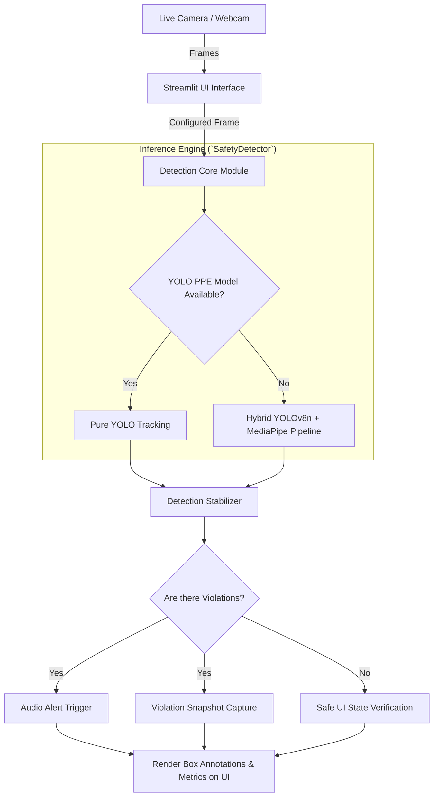
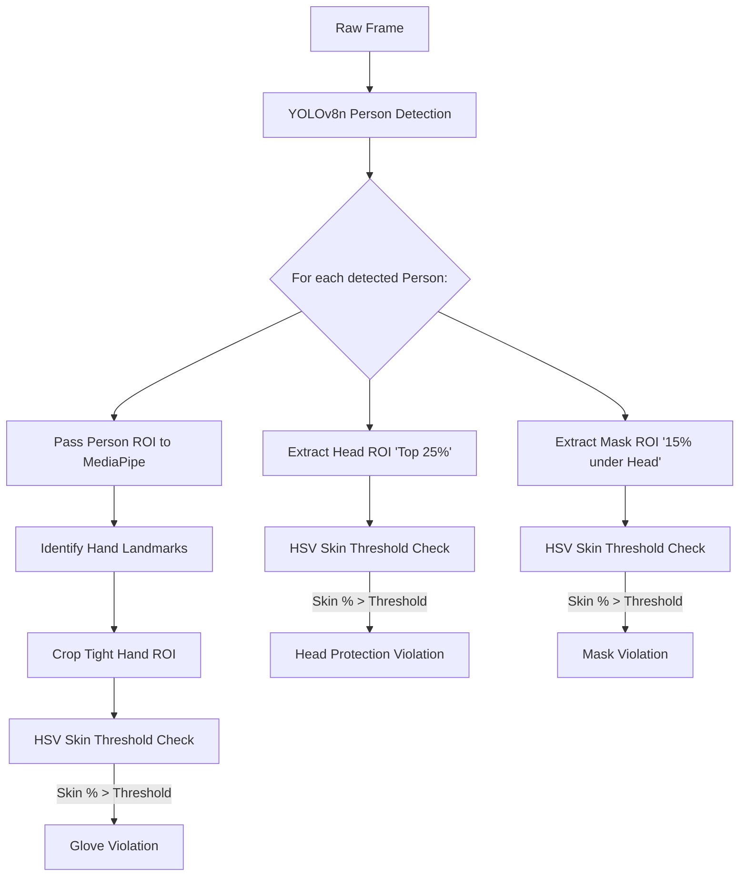
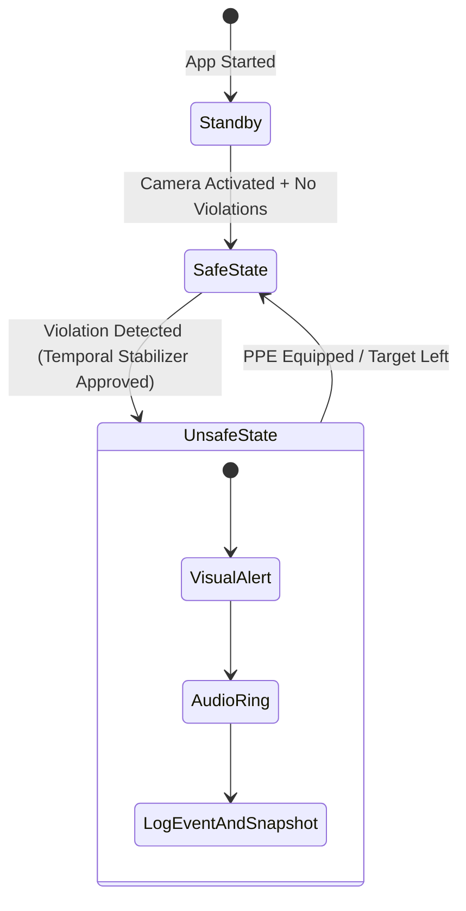

# 🛡️ AI-Based Safety Monitoring System

<p align="center">
  <b>A real-time Computer Vision system designed to enhance workplace safety by automatically detecting whether personnel are wearing required Personal Protective Equipment (PPE).</b>
</p>

<p align="center">
  
  
  
  
</p>

---

## 📌 Project Overview
The **AI-Based Safety Monitoring System** utilizes state-of-the-art Deep Learning and Computer Vision techniques to process live camera feeds. Its primary use case is within industrial domains, construction sites, and laboratories where strict adherence to safety protocols is mandatory.

By automatically monitoring personnel, the system significantly reduces the need for manual oversight, prevents accidents, and maintains a detailed chronological log of all safety violations for compliance tracking.

---

## 🚀 Quick Start
If you already have the requirements installed, start the application from the project folder:
```bash
streamlit run app.py
```
This automatically spins up a local server and seamlessly launches the dashboard in your default web browser. From there, toggle your camera "On" from the left sidebar!

---

## ✨ Key Features
- **🎩 Helmet & Head Protection:** Validates if an individual is wearing hard hats, helmets, or hairnets.
- **🧤 Gloves Detection:** Ensures hands are protected against hazardous materials using high-speed MediaPipe hand landmarking.
- **😷 Face Mask Verification:** Confirms whether a worker is wearing a sanitary or protective face mask.
- **🚀 Real-Time Processing:** Operates seamlessly at high FPS using lightweight models (YOLOv8n + MediaPipe).
- **🚨 Dynamic Alerting System:** Automatically triggers visual UI states (Green=Safe, Red=Unsafe) and auditory alarms upon violation.
- **📸 Automated Event Logging:** Captures screenshot evidence and logs violations to an `events.csv` registry with timestamps.
- **🖼️ Web Violation Gallery:** Review a grid of recent safety violation snapshots directly from the web dashboard.

---

## 🛠️ Tech Stack
| Component | Technology | Purpose |
| --- | --- | --- |
| **Language** | Python 3.9+ | Core application logic |
| **Computer Vision** | OpenCV (`cv2`) | Image manipulation, masking, & frame processing |
| **Deep Learning** | Ultralytics YOLOv8 | End-to-end personnel and PPE bounding box detection |
| **Landmarking** | MediaPipe | Structural pose mapping for robust hand tracking |
| **User Interface** | Streamlit | Rapid, reactive web-based dashboard creation |
| **Data Logistics** | Pandas / CSV | Event parsing and disk logging |

---

## 🏗️ System Architecture & Workflow

### 1. High-Level System Architecture
This diagram outlines the macro-level data flow from input across the internal services:



### 2. Hybrid Detection Pipeline (Fallback Mode)
When a custom YOLO PPE model isn't active, the system employs a highly-optimized fallback tracking approach using localized ROIs (Regions of Interest) and HSV skin thresholding:



### 3. UI State Workflow


---

## 📂 Project Structure

```text
📁 AI-Based Safety Monitoring System
├── 📄 app.py                  # Streamlit Web Application (Main Entry Point)
├── 📄 requirements.txt        # Python dependency list
├── 📄 README.md               # Detailed Project Documentation
├── 📄 PPE_TRAINING_GUIDE.md   # Guidelines for re-training YOLOv8 models
├── 📁 core/                   # Application internal logic modules
│   ├── 📄 alert.py            # Platform-specific audio alerting handlers
│   ├── 📄 detector.py         # Primary YOLO/Hybrid inference engine 
│   └── 📄 logger.py           # Snapshot capturing and CSV generation
├── 📁 assets/                 # Storage for media (Audio alarms, graphics)
├── 📁 captured_images/        # Auto-generated: Stores HD violation evidence
└── 📁 logs/                   # Auto-generated: Houses central events.csv
```

---

## ⚙️ Requirements & Installation

**Prerequisites:** Python 3.9 - 3.11, standard integrated or USB webcam. (Compatible with macOS, Windows, Linux)

**1. Clone the repository:**
```bash
git clone https://github.com/your-username/ai-safety-monitor.git
cd ai-safety-monitor
```

**2. Virtual Environment (Recommended):**
```bash
python3 -m venv .venv
source .venv/bin/activate  # macOS/Linux
# OR
.venv\Scripts\activate     # Windows
```

**3. Install Dependencies:**
```bash
pip install -r requirements.txt
```
*(If missing `requirements.txt`, install manually: `pip install streamlit opencv-python numpy mediapipe ultralytics`)*

---

## 🕹️ Dashboard Usage Guide
1. **Initialize:** Activate your virtual environment (`source .venv/bin/activate`) and run the app via `streamlit run app.py`.
2. **Camera Configuration:** Looking at the Control Panel on the right side of the **Live Monitoring** tab, choose your `Select Camera Index` (`0` is typically the front-facing webcam, `1` might be an external peripheral).
3. **Activate:** Toggle the **Turn On Camera** checkbox to begin telemetry.
4. **Monitor Metrics:** The top dashboard cards will immediately output live statistics: `People Count`, `Unprotected`, and `Total Violations`.
5. **View Evidence:** Switch to the **Violation Gallery** tab at any time to review and refresh saved image snapshots of any recorded rule violations.
6. **Test Alerts:** Remove a required safety item (like turning your head bare) to see the Streamlit UI turn Red and log an event locally.

---

## 🚧 Future Roadmap
- [ ] **Multi-Camera Feeds:** Add threading for concurrent RTP/RTSP CCTV streams.
- [ ] **Cloud Syncing:** Upgrade the `events.csv` logger to actively dump to an AWS S3 bucket and Postgres backend.
- [ ] **Edge Compatibility:** Export the Heavy PyTorch models (`.pt`) to ONNX/TensorRT for low-energy device compatibility.

---

## ❓ Troubleshooting & FAQs

**Q: I receive a `Could not open webcam at index X` error:**
> Another app may be consuming the hardware feed. Alter the dropdown index (e.g. `1` or `2`), or ensure Python/Streamlit has hardware camera access inside your OS privacy settings.

**Q: The system is running slowly or stuttering:**
> This signifies limited system compute power. By default, ensure nothing else is hogging the CPU/GPU. The Hybrid MediaPipe logic is optimized to only check isolated Person ROIs, but standard YOLO still requires moderate resources.

**Q: The Audio Alarm doesn't play!**
> The built-in audio handler evaluates OS conditions. macOS correctly maps to `afplay`. If you are on Windows, ensure the native `winsound` fallback code in `core/alert.py` is being triggered, or verify your audio drivers.

---
<p align="center"><i>Crafted to strictly enforce safety compliance worldwide.</i> 👷‍♂️🌍</p>
